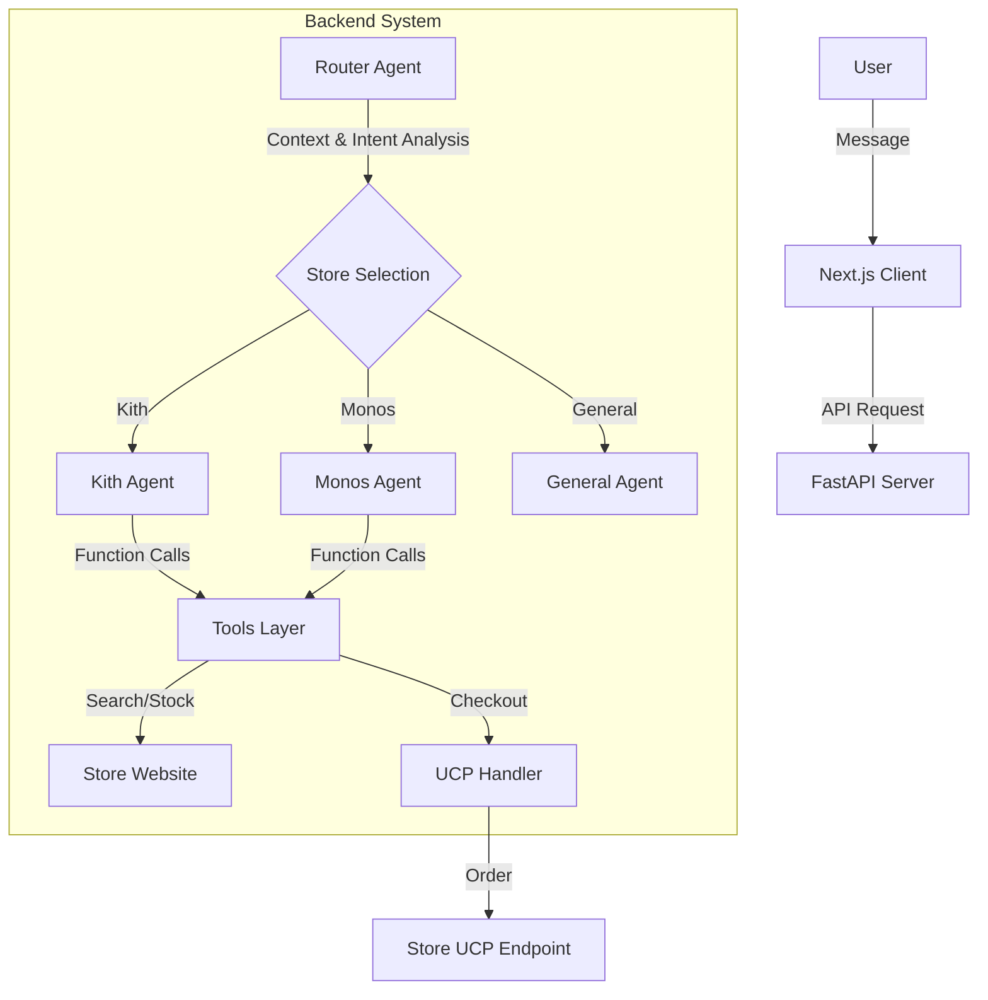

# 직구 에이전트 (Direct Purchase Agent)

**직구 에이전트 (DPAGENT)** 는 사용자의 쇼핑 의도를 파악하여 Kith, Monos, Everlane, Allbirds 등 해외 유명 쇼핑몰에서 상품을 검색하고, 재고를 확인하며, **Google UCP (Universal Commerce Protocol)** 를 통해 결제까지 지원하는 프리미엄 AI 에이전트 서비스입니다.


## 🚀 주요 기능 (Core Features)

### 1. 인텔리전트 멀티턴 라우팅 (Intelligent Multi-turn Routing)

- **맥락 인식** : 단순 키워드 매칭이 아닌, **LLM 기반 라우터** 가 사용자의 대화 흐름을 깊이 있게 분석합니다.
- **멀티턴 지원** : "그거 재고 있어?"와 같은 대명사가 포함된 후속 질문도 이전 대화 기록(History)을 참조하여 정확한 상점 에이전트로 연결합니다.

### 2. Universal Commerce Protocol (UCP) 통합

- **표준화된 결제** : 쇼핑몰마다 상이한 결제 프로세스를 UCP 표준으로 통일하여 사용자에게 일관된 결제 경험을 제공합니다.
- **핵심 기능** :
  - **ucp_create_checkout** : 장바구니 생성 및 체크아웃 세션 활성화.
  - **build_line_item_from_handle** : 상품 핸들을 UCP 규격의 라인 아이템으로 정규화.
  - (해당 상점의 `/.well-known/ucp.json` 지원 여부에 따라 작동합니다.)

### 3. 고신뢰성 백엔드 및 자동 복구 (Robustness)

- **자동 재시도 (Retry)** : Google Gemini API의 일시적 장애(500/503) 시 지수 백오프 전략으로 자동 재시도하여 중단 없는 서비스를 제공합니다.
- **안정성 패치** : API 호출 시 발생할 수 있는 데이터 누락을 방지하기 위해 `patches/google_genai.py` 를 통한 입출력 정규화 패치가 적용되어 있습니다.

### 4. 프리미엄 UI/UX

- **Glassmorphism Design** : 투명도와 블러 효과를 활용한 모던하고 고급스러운 인터페이스를 제공합니다.
- **실시간 사고 과정 시각화** : 에이전트가 어떤 도구를 호출하고, 어떤 일을 수행 중인지 실시간 배지 및 로그로 시각화합니다.

---

## 🏗️ 아키텍처 (Architecture)



1. **Frontend** : React, TailwindCSS, Framer Motion 기반의 고반응성 대화형 웹 인터페이스.
2. **Router** : `shopping_agent/agents/routing.py` 에서 전체 대화 맥락을 분석해 전문 에이전트 선별.
3. **Store Agents** : `LangGraph` 기반으로 동작하며, 각 상점에 최적화된 시스템 프롬프트 보유.
4. **Tools Layer** : 환율 연동, 관세 계산기, 실시간 재고 조회 기능 수행.

---

## 🧠 Deep Agent 아키텍처 (Deep Agent Technology)

본 프로젝트의 정체성은 단순한 챗봇이 아닌, **자율적으로 추론하고 문제를 해결하는 'Deep Agent'** 에 있습니다.

### 1. 자율적 추론 및 계획 (Reasoning & Planning)

- **TodoListMiddleware** : 작업을 시작하기 전 스스로 할 일 목록을 작성하고, 수행 결과에 따라 동적으로 계획을 수정합니다.
- **Thinking Block** : 모델의 내부 판단 과정을 UI에 파싱하여 노출함으로써 에이전트의 논리적 흐름을 투명하게 전달합니다.

### 2. 미들웨어 확장 구조 (Middleware Pattern)

- **ShoppingToolsMiddleware** : 검색, 재고 확인, 관세 계산 등 비즈니스 로직을 에이전트의 사고 루프에 유기적으로 결합합니다.
- 독립적인 미들웨어 구조로 설계되어 새로운 기능 추가가 용이합니다.

### 3. 지능형 메모리 시스템 (Persistent State)

- **CompositeBackend** : 세션 기반의 실시간 상태와 파일 시스템 기반의 장기 기억을 통합 관리합니다.
- `.memories/` 디렉토리를 통해 사용자의 과거 요청 스타일이나 특이사항을 학습하고 참조합니다.

---

## 🏁 시작하기 (Getting Started)

### 1. 필수 요구사항
- Python 3.11+
- Node.js 18+
- `uv` 패키지 매니저

### 2. 환경 변수 설정
`.env` 파일을 생성하고 아래 키를 입력하세요.

```env
GOOGLE_API_KEY=your_gemini_api_key
EXIM_AUTH_KEY=your_exim_api_key
```

### 3. 실행 방법
```bash
chmod +x run.sh
./run.sh
```
- **Backend API** : http://localhost:8000
- **Frontend App** : http://localhost:3001

---

## 💱 환율 및 금융 데이터 (Financial Data)

정확한 가격 산출을 위해 **한국수출입은행 Open API** 를 활용합니다.

- **실시간 고시 환율** : 대한민국 원화(KRW) 기준 환율을 실시간으로 가져옵니다.
- **스마트 캐싱** : `shopping_agent/.cache/exchange_rates.json` 을 통해 불필요한 API 호출을 방지합니다.
- **관세 자동 계산** : 품목별 관세율과 환율을 결합하여 최종 납부 금액을 추정합니다.

---

## 🔒 UCP 인증 및 보안 (UCP & Security)

일부 상점의 UCP API 보안 제약을 **자동 폴백 (Fallback) 시스템** 으로 극복합니다.

1. UCP API 호출 시 인증 에러가 발생하면 시스템이 이를 즉시 감지합니다.
2. 내부적으로 **Shopify Cart Permalink** 시스템을 가동하여 유효한 결제 주소를 생성합니다.
3. 사용자는 중단 없이 실제 쇼핑몰의 카트로 안전하게 연결됩니다.

---

## 🐛 트러블슈팅 (Troubleshooting)

**Q. Gemini API 호출 중 ValueError 가 발생합니다.**
- **A** : 빈 메시지 전달 시 발생하는 이슈로, 현재 `patches/google_genai.py` 를 통해 모든 입출력을 안전하게 정규화하고 있습니다.

## 🚧 향후 과제 및 로드맵 (Future Roadmap)

현재 프로젝트는 핵심 기능을 성공적으로 구현했으나, 상용화 및 고도화를 위해 아래와 같은 과제들을 안고 있습니다.

### 1. UCP 인증 고도화 (Auth Limitation)
- **현재** : 일부 상점에서 Storefront Access Token을 스크래핑하거나 폴백(Permalink) 방식을 사용하고 있습니다.
- **해결 방안** : 각 쇼핑몰과의 정식 OAuth 연동 또는 상점별 전용 인증 대행 레이어를 구축하여 완전한 UCP 결제 플로우를 구현할 예정입니다.

### 2. 세밀한 개인화 (Personalization)
- **현재** : 기본 상품 정보 위주로 최적의 상품을 제안합니다.
- **해결 방안** : 사용자의 의류/신발 사이즈, 선호 색상, 과거 구매 이력을 메모리(`FilesystemBackend`)에 더 깊게 반영하여 "나에게 딱 맞는" 상품을 먼저 추천하는 기능을 강화할 예정입니다.

### 3. 멀티 벤더 결제 통합 (Multi-vendor Payment)
- **현재** : 한 번에 하나의 상점 결제를 지원합니다.
- **해결 방안** : 여러 상점의 상품을 하나의 장바구니처럼 담아 한 번의 결제 토큰으로 처리하는 통합 결제 시스템을 연구 중입니다.

---

**Coded with ❤️ by @jh941213**
