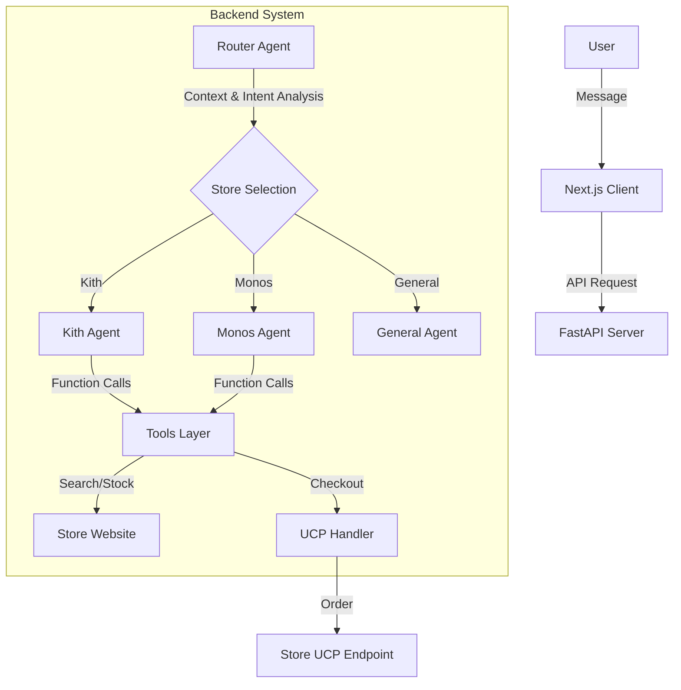
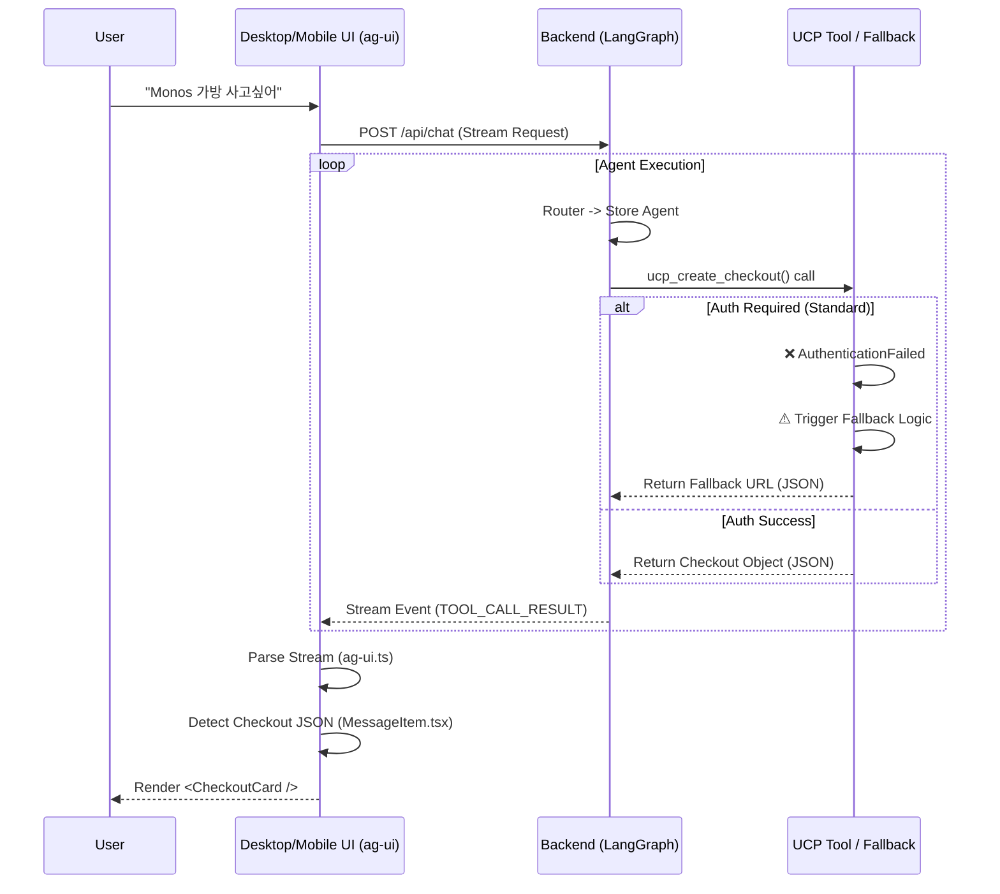

# 직구 에이전트 (Direct Purchase Agent)

**직구 에이전트(DPAGENT)**는 사용자의 쇼핑 의도를 파악하여 Kith, Monos, Everlane, Allbirds 등 해외 유명 쇼핑몰에서 상품을 검색하고, 재고를 확인하며, **Google UCP(Universal Commerce Protocol)**를 통해 결제까지 지원하는 AI 에이전트 서비스입니다.


## 🚀 주요 기능 (Core Features)

### 1. 인텔리전트 멀티턴 라우팅 (Intelligent Multi-turn Routing)
- **맥락 인식**: 단순 키워드 매칭이 아닌, **LLM 기반 라우터**가 사용자의 대화 흐름을 분석합니다.
- **멀티턴 지원**: "그거 재고 있어?"와 같은 대명사가 포함된 후속 질문도 이전 대화(History)를 참조하여 정확한 상점 에이전트(예: Kith Agent)로 연결합니다.

### 2. Universal Commerce Protocol (UCP) 통합
- **표준화된 결제**: 쇼핑몰마다 다른 결제 방식을 UCP 표준으로 통일하여 처리합니다.
- **주요 도구**:
  - `ucp_create_checkout`: 장바구니 생성 및 체크아웃 세션 시작
  - `build_line_item_from_handle`: 상품 핸들을 UCP 라인 아이템으로 변환
  - (주의: 상점의 `/.well-known/ucp.json` 지원 여부에 따라 작동합니다)

### 3. 고신뢰성 백엔드 (Robust Backend)
- **자동 재시도(Retry)**: Google Gemini API의 500/503 에러 발생 시 지수 백오프(Exponential Backoff)로 자동 재시도합니다.
- **안정성 패치**: 빈 메시지로 인한 API 에러(`ValueError: contents are required`)를 방지하기 위한 입력/출력 몽키 패치(Monkey Patch)가 적용되어 있습니다.

### 4. 현대적인 UI/UX
- **Glassmorphism Design**: 투명도와 블러 효과를 활용한 고급스러운 인터페이스.
- **실시간 생각 과정(Thinking Process)**: 에이전트가 어떤 도구를 쓰고 있는지, 무엇을 고민하는지 실시간으로 시각화합니다. (🛠️ 도구 호출 내역 포함)

---

## 🏗️ 아키텍처 (Architecture)



1. **Frontend**: React, TailwindCSS, Framer Motion 기반의 대화형 웹 UI.
2. **Router**: `shopping_agent/agents/routing.py`에서 전체 대화 기록(`messages`)을 분석해 적절한 전문 에이전트로 라우팅.
3. **Store Agents**: `LangGraph` 기반으로 동작하며, 각 상점에 특화된 프롬프트와 도구(`shopping_agent/agents/stores.py`)를 보유.
4. **Tools**: 환율 계산, 관세 계산, 상품 검색, 재고 확인 등 실질적인 작업 수행.

---

## 🛠️ 기술 스택 (Tech Stack)

- **Backend**: Python 3.11+, FastAPI, LangGraph, LangChain
- **Frontend**: TypeScript, Next.js 14, Tailwind CSS
- **AI Model**: Google Gemini 1.5 (Pro/Flash)
- **Package Manager**: `uv` (Python), `npm` (Node.js)

---

## 🧠 Deep Agent 아키텍처 (Deep Agent Architecture)

이 프로젝트의 핵심은 단순한 챗봇이 아닌, **'스스로 생각하고 행동하는' Deep Agent** 기술에 있습니다. `shopping_agent/agents/store_agent.py`는 `deepagents` 라이브러리를 기반으로 설계되었습니다.

### 1. 추론 및 계획 (Reasoning & Planning)
- **TodoListMiddleware**: 모든 에이전트는 작업을 시작하기 전 `write_todos`를 통해 스스로 계획을 수립합니다.
- **Agentic Loop**: 계획 수립 -> 도구 실행 -> 결과 관찰 -> 계획 수정의 루프를 독자적인 추론 엔진을 통해 수행합니다.

### 2. 미들웨어 아키텍처 (Middleware Pattern)
- **`ShoppingToolsMiddleware`**: 검색, 재고 확인, 관세 계산 등 쇼핑에 특화된 도구들을 에이전트의 사고 과정에 유기적으로 결합합니다.
- 확장이 용이한 구조로, 새로운 쇼핑몰이나 기능을 미들웨어 형태로 즉시 추가할 수 있습니다.

### 3. 영구적 기억 및 상태 관리 (Persistent Memory)
- **CompositeBackend**: 에이전트의 상태를 다중 계층으로 관리합니다.
  - **StateBackend**: 현재 대화의 실시간 상태 관리.
  - **FilesystemBackend**: `.memories/` 디렉토리를 통해 사용자의 취향이나 이전 이력을 영구적으로 저장하고 참조합니다.

---

## ⚙️ 상세 워크플로우 메커니즘 (Detailed Workflow Mechanism)

이 프로젝트는 **Backend (LangGraph)**와 **Frontend (ag-ui)**가 유기적으로 연결되어 동작합니다.

### 1. 전체 데이터 흐름 (End-to-End Flow)



### 2. Frontend 핵심 메커니즘 (`ag-ui`)

프론트엔드는 **Server-Sent Events (SSE)**를 통해 백엔드의 모든 "생각하는 과정"을 실시간으로 시각화합니다.

*   **`frontend/lib/ag-ui.ts`**: 스트림 파서의 핵심입니다.
    *   `StreamUpdate` 타입을 통해 텍스트(`text`), 도구 호출(`toolCalls`), 할 일(`todos`) 등을 실시간으로 업데이트합니다.
    *   `extractUpdate` 함수가 백엔드에서 오는 복잡한 JSON 이벤트를 UI 상태로 정규화합니다.

*   **`frontend/components/chat/MessageItem.tsx`**: 체크아웃 UI 렌더링을 담당합니다.
    *   에이전트 메시지를 분석하여 `ucp_create_checkout` 도구의 실행 결과가 있는지 감지합니다.
    *   **Checkout Logic**: 도구 결과(JSON)를 파싱하여 `id`, `url`, `totals` 정보를 추출하고, 이를 기반으로 `<CheckoutCard />` 컴포넌트를 동적으로 렌더링합니다.

---

## 🏁 시작하기 (Getting Started)

### 1. 필수 요구사항
- Python 3.11 이상
- Node.js 18 이상
- `uv` 패키지 매니저 (`pip install uv`)

### 2. 환경 변수 설정
`.env` 파일을 프로젝트 루트에 생성하고 API 키를 설정하세요.

```env
GOOGLE_API_KEY=your_gemini_api_key
EXIM_AUTH_KEY=your_exim_api_key
```

### 3. 실행
통합 실행 스크립트를 사용하면 백엔드와 프론트엔드를 한 번에 실행할 수 있습니다.

```bash
chmod +x run.sh
./run.sh
```
- **Backend**: http://localhost:8000
- **Frontend**: http://localhost:3001

---

## � 환율 및 금융 데이터 (Exchange Rate API)

이 프로젝트는 실시간 환율 정보 및 관세 계산을 위해 **한국수출입은행(Korea Eximbank) Open API**를 사용합니다.

### 1. 주요 특징
- **실시간 환율 조회**: 대한민국 원화(KRW) 기준의 고시 환율을 실시간으로 가져옵니다.
- **로컬 캐싱 시스템**: `shopping_agent/.cache/exchange_rates.json` 파일에 당일 환율을 캐싱하여 API 호출 횟수를 최소화하고 성능을 최적화합니다.
- **주말/공휴일 대응**: 해외 상점의 결제 시점을 기준으로 가장 최근 영업일의 환율을 자동으로 조회합니다.

### 2. 설정 방법
- [한국수출입은행 API 센터](https://www.koreaexim.go.kr/site/program/financial/exchange)에서 인증키를 발급받으세요.
- `.env` 파일에 `EXIM_AUTH_KEY` 항목으로 저장합니다.

---

## �🐛 트러블슈팅

**Q. API 500 에러가 계속 떠요.**
A. 최신 버전에는 재시도 로직이 포함되어 있습니다. 서버를 재시작해보세요.

**Q. `ValueError: contents are required` 에러가 발생해요.**
A. Gemini API에 빈 메시지가 전달되어 발생하는 문제입니다. `patches/google_genai.py`를 통해 자동으로 빈 내용을 공백으로 치환하는 패치가 적용되었으니 안심하세요.

---

## 🔒 UCP 인증 및 제한 사항 (Known Limitations: UCP Authentication)

현재 Monos, Kith, Everlane 등 일부 상점의 UCP API는 **'엄격한 사용자 인증(User Authentication)'**을 요구합니다. 이로 인해 일반적인 API 호출 시 `AuthenticationFailed` 또는 `Unsupported authentication strategy` 에러가 발생할 수 있습니다.

### 현재 조치 사항 (Current Implementation)
사용자 편의를 위해 **자동 폴백(Fallback) 시스템**을 구축했습니다.
1. UCP 체크아웃 생성 시도가 `AuthenticationFailed`로 실패할 경우, 시스템이 이를 자동으로 감지합니다.
2. 에러를 사용자에게 노출하는 대신, **Shopify 공식 다이렉트 카트 링크(Cart Permalink)**를 즉시 생성하여 제공합니다.
3. 사용자는 동일하게 "결제하기" 버튼을 눌러 구매를 진행할 수 있습니다.

### 향후 계획 (Future Roadmap)
추후 상점과의 제휴 또는 공개 OAuth가 지원될 경우, 다음과 같은 정식 인증 절차를 도입할 예정입니다.
1. **OAuth 2.0 Flow**: 사용자가 채팅창에서 상점 계정으로 로그인.
2. **Customer Access Token**: 상점으로부터 유효한 토큰을 발급받아 UCP 헤더(`X-Shopify-Customer-Access-Token`)에 포함.
3. **완전한 UCP 기능**: 장바구니 수정, 주소록 로딩 등 개인화된 기능 지원.

---

**Made by @jh941213**
