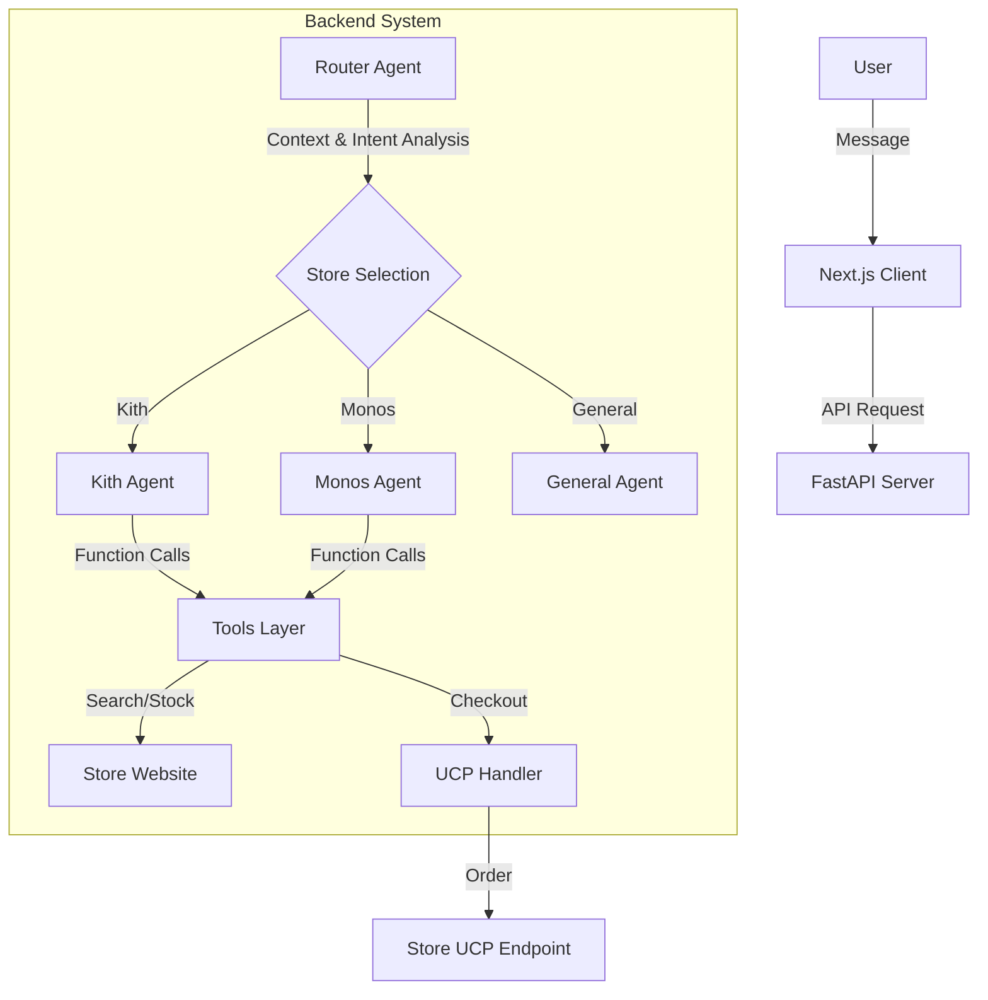

# Direct Purchase Agent (DPAGENT)

[**한국어 버전 (Korean Version)**](./README.md)

**Direct Purchase Agent (DPAGENT)** is a premium AI agent service that understands user shopping intent, searches for products on famous international malls like Kith, Monos, Everlane, and Allbirds, checks real-time inventory, and supports seamless checkout via **Google UCP (Universal Commerce Protocol)**.


## 🚀 Core Features

### 1. Intelligent Multi-turn Routing
- **Context Awareness**: An **LLM-based router** analyzes the conversation flow beyond simple keyword matching.
- **Multi-turn Support**: References conversation history to accurately connect follow-up questions like "Is that in stock?" to the correct store agent (e.g., Kith Agent).

### 2. Universal Commerce Protocol (UCP) Integration
- **Standardized Checkout**: Unifies different checkout processes from various malls into the UCP standard for a consistent user experience.
- **Key Functions**:
  - **ucp_create_checkout**: Creates a cart and activates a checkout session.
  - **build_line_item_from_handle**: Normalizes product handles into UCP-compliant line items.
  - (Works based on the store's `/.well-known/ucp.json` support.)

### 3. Robust Backend & Auto-recovery
- **Automatic Retry**: Implements exponential backoff to handle temporary Google Gemini API failures (500/503) for uninterrupted service.
- **Stability Patch**: Input/output normalization via `patches/google_genai.py` prevents data loss and empty message errors during API calls.

### 4. Premium UI/UX
- **Glassmorphism Design**: Provides a modern and premium interface utilizing transparency and blur effects.
- **Real-time Thinking Visualization**: Visualizes the agent's work process, including tool calls and todo progress, via real-time badges and logs.

---

## 🏗️ Architecture



1. **Frontend**: High-responsivity interactive web interface based on React, TailwindCSS, and Framer Motion.
2. **Router**: Analyzes the entire dialogue context in `shopping_agent/agents/routing.py` to select the best specialized agent.
3. **Store Agents**: Powered by `LangGraph`, utilizing system prompts optimized for each specific store.
4. **Tools Layer**: Handles currency conversion, customs calculation, and real-time inventory checks.

---

## 🧠 Deep Agent Technology

The identity of this project lies in being a **'Deep Agent' that reasons and solves problems autonomously**, rather than just a simple chatbot.

### 1. Autonomous Reasoning & Planning
- **TodoListMiddleware**: Automatically creates a task list before starting work and dynamically adjusts the plan based on tool results.
- **Thinking Block**: Parses and exposes the model's internal reasoning process to the UI for full transparency.

### 2. Middleware Extension Pattern
- **ShoppingToolsMiddleware**: Organically integrates complex business logic (search, stock, customs) into the agent's reasoning loop.
- Designed with an independent middleware structure for easy extension of new stores and features.

### 3. Intelligent Memory System (Persistent State)
- **CompositeBackend**: Integrates session-based real-time state (`StateBackend`) with filesystem-based long-term memory (`FilesystemBackend`).
- Learns and references user preferences and past request history via the `.memories/` directory.

---

## 🏁 Getting Started

### 1. Requirements
- Python 3.11+
- Node.js 18+
- `uv` package manager (recommended)

### 2. Environment Setup
Create a `.env` file in the root directory and enter the following keys.

```env
GOOGLE_API_KEY=your_gemini_api_key
EXIM_AUTH_KEY=your_exim_api_key
```

### 3. How to Run
Use the provided script to start both the backend and frontend simultaneously.

```bash
chmod +x run.sh
./run.sh
```
- **Backend API**: http://localhost:8000
- **Frontend App**: http://localhost:3001

---

## 💱 Financial Data (Exchange Rates)

Utilizes the **Korea Eximbank Open API** for accurate price calculations.

- **Real-time Rates**: Fetches real-time exchange rates relative to KRW.
- **Smart Caching**: Minimizes API calls and ensures fast responses via `shopping_agent/.cache/exchange_rates.json`.
- **Customs Calculation**: Estimates final payment amounts by combining item category tax rates and current exchange rates.

---

## 🔒 UCP & Security

Overcomes UCP API security constraints in some stores via an **Automatic Fallback System**.

1. Automatically detects authentication errors (`AuthenticationFailed`) during UCP API calls.
2. Instead of showing an error, it triggers the **Shopify Cart Permalink** system to generate a valid direct payment URL.
3. Users are safely connected to the actual store's cart without interruption.

---

## 💳 Payment Feasibility Status

Clarification of the current **"Payment Capability"** status.

### 1. Technically "Code-Ready"
All tools for payment are implemented, and agents are instructed to **"use UCP tools if the user wants to pay"**.
- **build_line_item_from_handle**: Converts product info to UCP data.
- **ucp_create_checkout**: Requests real payment session creation.

### 2. Functionally "Store-Dependent"
Actual checkout success depends on whether the merchant (e.g., Kith) has **activated the UCP protocol**.
- The agent first looks for the `/.well-known/ucp` file. If the store doesn't provide it, the process stops with a "Store does not support UCP" message.

### 3. Current Status per Store & Testing
- **Monos**: Most likely to be supported as it's a primary example in Google UCP documentation.
- **Kith** / **Everlane**: Currently based on Shopify; success depends on their official UCP activation.
- **💡 How to Test**: Try asking **"Checkout a Monos bag for me"** or **"I want to pay for Kith shoes"**. You can see the agent's real-time manifest fetching attempts in the "Thinking" block with the 🛠️ icon.

---

## 🐛 Troubleshooting

**Q. ValueError: contents are required occurs during Gemini API calls.**
- **A**: This happens when an empty message is passed. Current logic in `patches/google_genai.py` handles this by normalizing all inputs safely.

---

## 🚧 Future Roadmap

The project aims for the following optimizations for commercialization.

### 1. Advanced UCP Auth Integration
- **Current**: Using token scraping or fallback (Permalink) methods.
- **Plan**: Implement official OAuth integration or dedicated auth proxy layers for a full UCP checkout flow.

### 2. Fine-grained Personalization
- **Current**: Suggests top products based on basic info.
- **Plan**: Deeply reflect user size/color preferences and past purchase history in the `FilesystemBackend` for curated recommendations.

### 3. Multi-vendor Multi-checkout
- **Current**: Supports checkout for one store at a time.
- **Plan**: Research unified checkout systems to process multiple store items with a single payment token.

---

**Coded with ❤️ by @jh941213**
