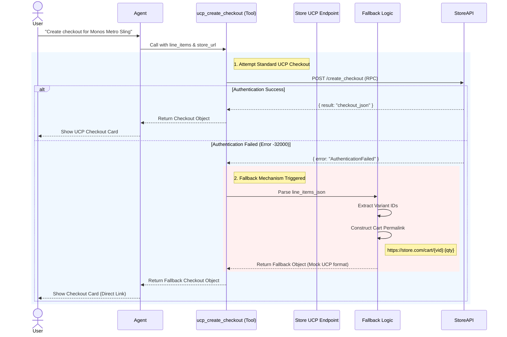

# UCP Checkout Process & Fallback Workflow

This document visualizes the checkout creation process, including the **Authentication Fallback Mechanism** implemented for stores with strict UCP security (e.g., Monos, Kith).

## Key Logic

1.  **Primary Strategy**: Attempt to use the standardized Google UCP `create_checkout` method.
2.  **Error Handling**: specifically listen for `AuthenticationFailed` or `Unsupported authentication strategy`.
3.  **Fallback Strategy**: 
    - Parse the intended items.
    - Generate a **Shopify Cart Permalink** (Standard Feature).
    - Wrap the URL in a structure compatible with the Agent's frontend, ensuring the UI renders correctly without breaking the user experience.
